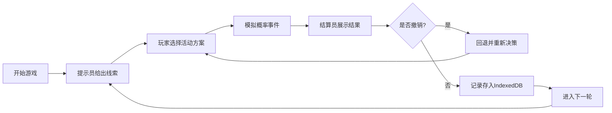

## 1. 产品概述

概率决策休闲游戏，玩家在风险与收益之间进行策略选择，通过合理安排活动抽签、排队和奖励顺序来最大化分数。支持撤销/重做功能，允许回退策略并重新结算。

- 核心玩法：概率事件决策，平衡风险收益
- 目标用户：喜欢策略和概率类游戏的休闲玩家
- 价值：提供有趣的决策体验，培养概率思维

## 2. 核心功能

### 2.1 用户角色

| 角色 | 说明 | 核心功能 |
|------|------|----------|
| 玩家 | 游戏操作者 | 做出决策，选择活动方案 |
| 提示员 | 信息提供者 | 给出概率线索和风险提示 |
| 结算员 | 结果展示者 | 展示分数和复盘记录 |

### 2.2 功能模块

1. **游戏主界面**：活动选择区、概率提示区、状态信息区
2. **排队管理**：等待队列显示、拥挤度提示
3. **奖励系统**：奖励顺序安排、奖励池管理
4. **撤销/重做**：回退上一轮策略，重新结算
5. **复盘记录**：历史决策记录，IndexedDB 持久化存储

### 2.3 页面详情

| 页面名称 | 模块名称 | 功能描述 |
|---------|---------|----------|
| 游戏主页面 | 活动选择区 | 展示可选活动项目，显示基础概率和收益 |
| 游戏主页面 | 概率提示区 | 提示员角色展示本轮风险线索和概率趋势 |
| 游戏主页面 | 状态信息区 | 显示当前分数、轮次、排队人数、奖励池 |
| 游戏主页面 | 操作控制区 | 确认选择、撤销、重做、开始新轮次 |
| 复盘面板 | 历史记录列表 | 展示每轮的决策、结果和分数变化 |
| 复盘面板 | 详情查看 | 查看单轮详细的概率计算和结算过程 |

## 3. 核心流程

玩家开始新游戏 → 提示员给出本轮概率线索 → 玩家选择活动和排队策略 → 系统模拟概率事件 → 结算员展示结果和分数 → 玩家可选择撤销/重做或进入下一轮 → 游戏记录存入 IndexedDB

## 4. 用户界面设计

### 4.1 设计风格

- **主色调**：深紫色 (#6C5CE7) + 金色 (#FDCB6E) + 深灰背景 (#2D3436)
- **辅助色**：青色 (#00CEC9) 表示高概率，红色 (#FF7675) 表示高风险
- **按钮风格**：圆角胶囊形，渐变背景，悬停时有缩放和发光效果
- **字体**：标题使用 'Orbitron' 科技感字体，正文使用 'Noto Sans SC'
- **布局风格**：卡片式布局，玻璃态效果 (glassmorphism)，层次分明
- **动效**：选择时有弹性动画，结算时有数字滚动效果

### 4.2 页面设计概览

| 页面名称 | 模块名称 | UI 元素 |
|---------|---------|---------|
| 游戏主页面 | 活动卡片 | 半透明玻璃卡片，悬停上浮，选中状态发光边框 |
| 游戏主页面 | 概率进度条 | 彩色渐变进度条，显示概率百分比 |
| 游戏主页面 | 分数展示 | 大号数字，金色渐变文字，数字滚动动画 |
| 游戏主页面 | 排队队列 | 横向排列的头像/图标，显示拥挤程度 |
| 复盘面板 | 时间线 | 纵向时间线，每轮节点带颜色标识 |

### 4.3 响应式

- 桌面端优先设计，三栏布局
- 平板端自适应为两栏
- 移动端单列布局，优化触摸区域
- 所有交互元素最小尺寸 44px

### 4.4 视觉细节

- 背景使用深色渐变 + 轻微噪点纹理
- 卡片使用 backdrop-filter 模糊效果
- 重要信息使用发光文字效果
- 概率变化时使用平滑过渡动画
- 撤销/重做按钮使用历史回退图标样式
