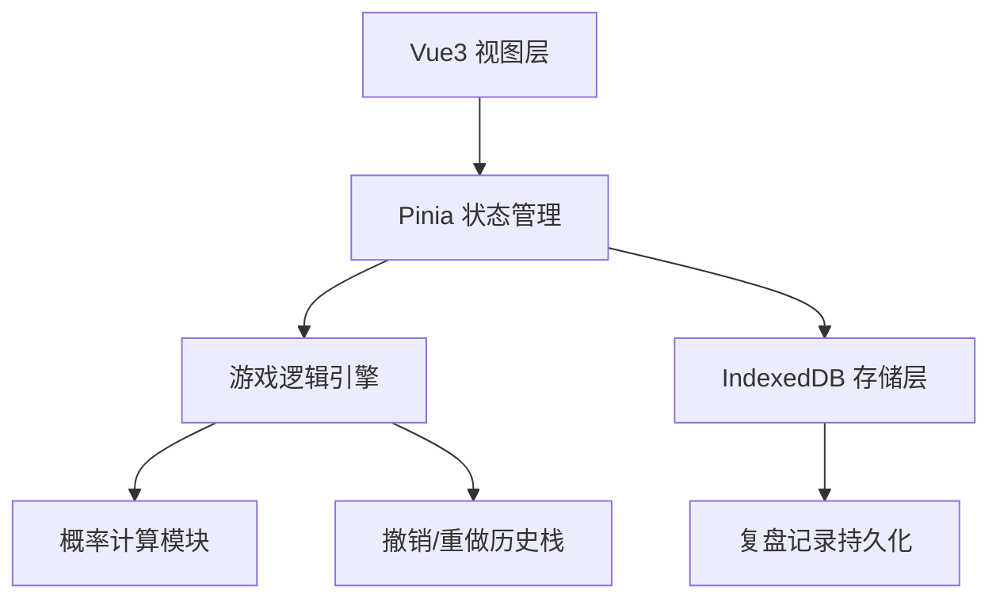
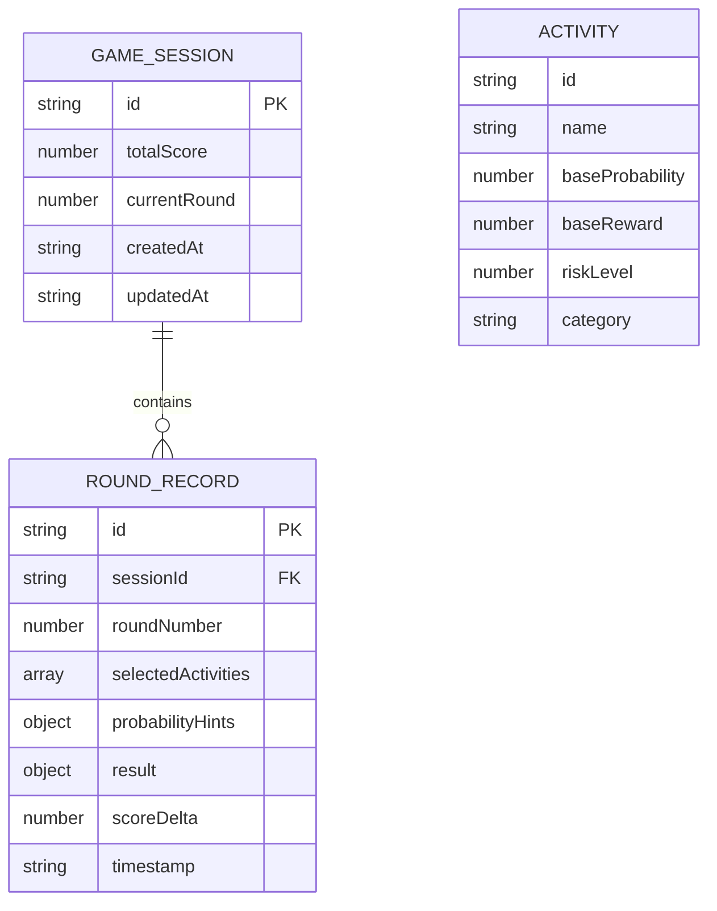

## 1. 架构设计



## 2. 技术描述

- **前端框架**: Vue@3.4 + Vite@5.0
- **状态管理**: Pinia@2.1
- **样式方案**: TailwindCSS@3.4 + CSS 变量
- **数据存储**: IndexedDB (idb 库封装)
- **类型系统**: TypeScript@5.3
- **构建工具**: Vite@5.0

## 3. 路由定义

| 路由 | 页面 | 说明 |
|------|------|------|
| / | 游戏主页面 | 包含游戏区域、控制面板、复盘面板 |

## 4. 数据模型

### 4.1 数据模型定义



### 4.2 IndexedDB Store 定义

```typescript
// game_sessions 表
interface GameSession {
  id: string;
  totalScore: number;
  currentRound: number;
  createdAt: string;
  updatedAt: string;
}

// round_records 表
interface RoundRecord {
  id: string;
  sessionId: string;
  roundNumber: number;
  selectedActivities: Activity[];
  probabilityHints: ProbabilityHint[];
  result: RoundResult;
  scoreDelta: number;
  timestamp: string;
}
```

## 5. 核心模块结构

```
src/
├── stores/              # Pinia 状态管理
│   ├── gameStore.ts     # 游戏主状态
│   └── historyStore.ts  # 撤销/重做历史
├── engine/              # 游戏逻辑引擎
│   ├── probability.ts   # 概率计算
│   ├── activities.ts    # 活动配置
│   └── settlement.ts    # 结算逻辑
├── db/                  # IndexedDB 封装
│   └── index.ts         # 数据库操作
├── components/          # Vue 组件
│   ├── ActivityCard.vue
│   ├── HintPanel.vue
│   ├── ScoreBoard.vue
│   ├── QueueDisplay.vue
│   ├── ControlBar.vue
│   └── ReviewPanel.vue
├── types/               # TypeScript 类型
│   └── index.ts
└── App.vue
```

## 6. 撤销/重做实现方案

使用命令模式 + 历史栈实现：

```typescript
interface HistoryState {
  past: GameState[];   // 历史状态栈
  present: GameState;  // 当前状态
  future: GameState[]; // 未来状态栈（重做用）
}

// 撤销: pop past, present -> future.unshift
// 重做: future.shift -> present, present -> past.push
```
